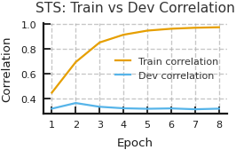
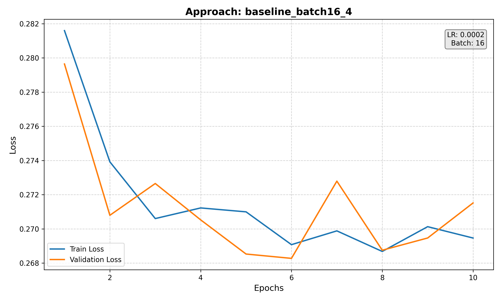
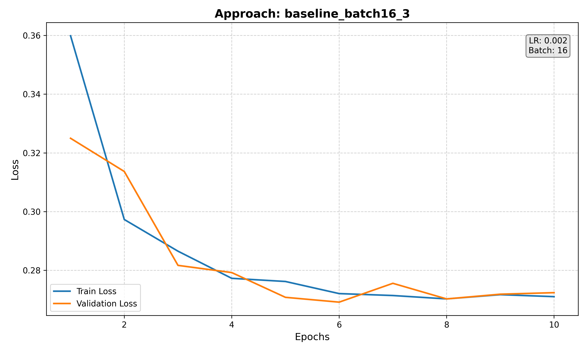
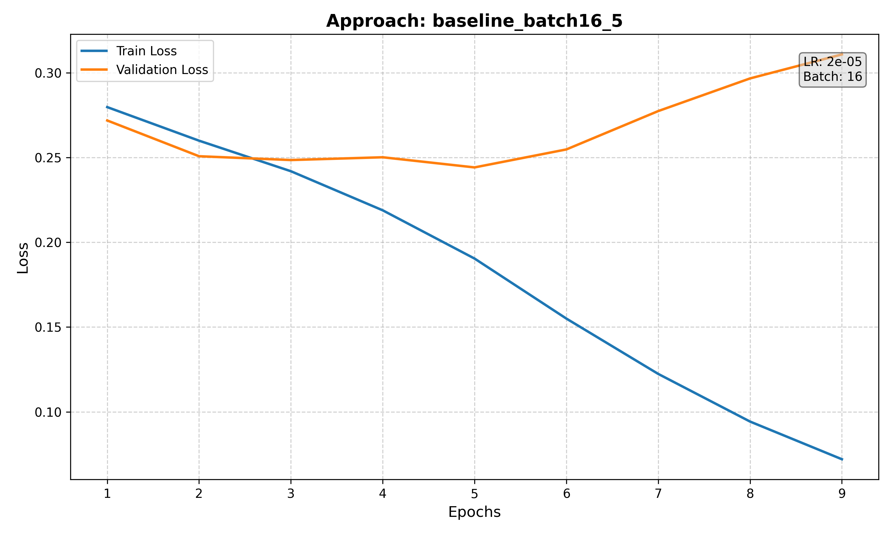
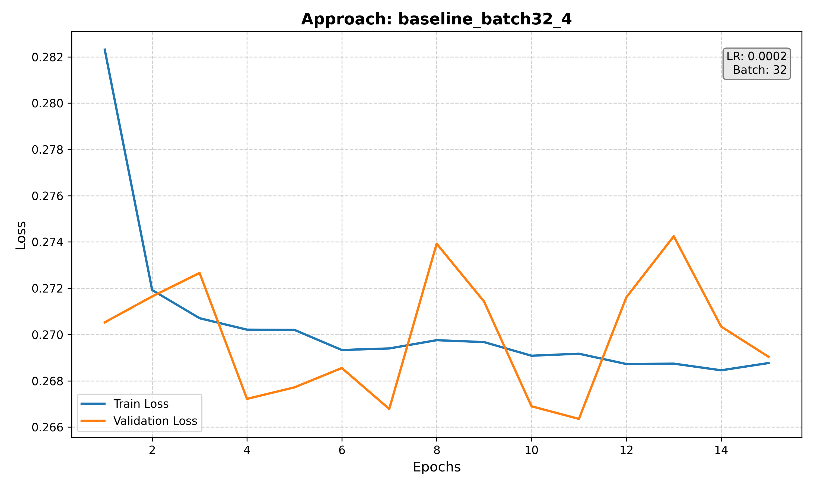
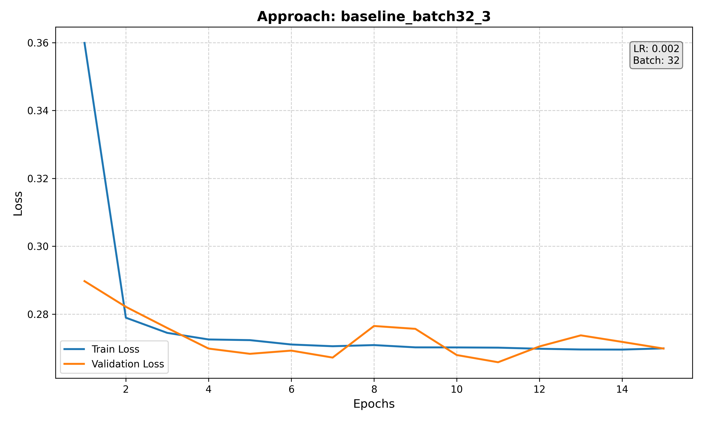
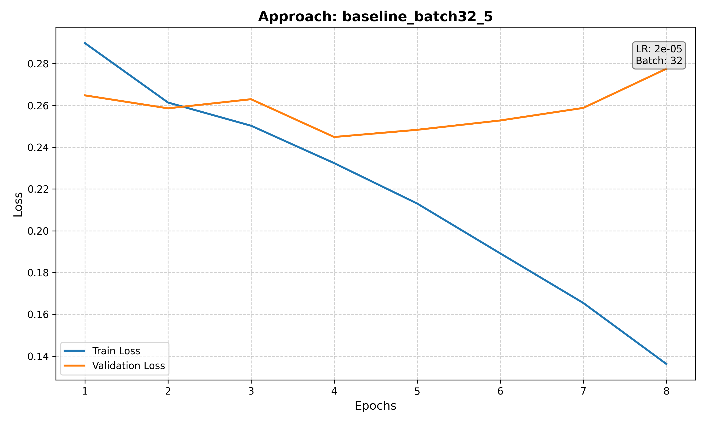

# Pretrain and Pray

-   **Group name:** Pretrain and Pray
    
-   **Group repository:** https://github.com/BerfinTaskin/DL_NLP
    
-   **Tutor responsible:** 	Niklas Bauer
    
-   **Group team leader:** Berfin Taskin
    
-   **Group members:** 
- Berfin Taskin    ->  berfin.taskin@stud.uni-goettingen.de 
- Ashutosh Jaiswal ->  ashutosh.jaiswal@stud.uni-goettingen.de
- Jonathan Henrich ->  jonathan.henrich@uni-goettingen.de
- Emre Semercioglu ->  emre.semercioglu@stud.uni-goettingen.de
- Shrinath Madde   ->  shrinath.madde@stud.uni-goettingen.de

  
# Setup instructions 
To make use of the functionality provided in this repository, you first have to set up the environment.
We recommend using Conda. If Conda is installed and activated, run the following command from the repository root:

```
source _setup/setup.sh
```

The baseline results can be obtained as described by using the standard `multitask_classifier.py` file using the default command line interface that was already implemented. The improvements are implemented in separate .py files. For example, the improvements for the STS task are implemented in `improvements_sts.py`. The corresponding experiment scripts and code of this improvement can be found accordingly in the `improvements_sts` folder. Within this folder there is a separate readme that explains how to run the experiments. The same holds for the other improvements. 

# Best improvements
### BERT sentiment analysis
```
python sst_P02_final.py \
  --epochs 6 \
  --batch_size 128 \
```
### BERT semantic textual similarity:
Running the training script for the best improvement for the STS task can be done as follows:
```
python improvements_sts.py \
    --epochs 8 \
    --option finetune \
    --use_gpu \
    --seed 50 \
    --augment_prob 0.0 \
    --head_style 2 \
    --embedding_style cls \
    --loss_function mse \
    --hidden_dropout_prob 0.3 \
    --lr_backbone 1e-4 \
    --lr_head 1e-4 \
    --batch_size 128 \
```

### BERT Paraphrase Detection
Best performance for the Quora Question Pairs Paraphrase Detection can be achieved with the following command:

```
python -m improvements_qqp.train_simcse \
    --use_gpu \
    --epochs 3 \
    --batch_size 128 \
    --lr 3e-5 \
    --temperature=0.1 \
    --pooling mean \
    --symmetric
```

### BART Generation
Running the training script for the best improvement for the BART Generation task can be done as follows:
```
python3 finetune_bart_generation.py --use_gpu
```


### BART Detection
Running the training script for the best improvement for the BART Generation task can be done as follows:
```
python -u bart_detection.py \
    --use_gpu \
    --num_epochs 30 \
    --batch_size 2 \
    --learning_rate 2e-5 \
    --early_stopping_patience 4 \
    --approach "mean-pool-dropout on Baseline Approach" \
    --job_id "${SLURM_JOB_ID}"

```


# Methodology
### BERT sentiment analysis

We set out to improve the baseline SST sentiment classifier by leveraging the **ordinal nature** of sentiment labels. Instead of treating the problem as a standard categorical classification task, we reformulated it as an **ordinal regression problem**. Sentiment labels (very negative → very positive) have an inherent ranking, and ordinal regression allows the model to explicitly respect this order during training.

**Key Design Choices**
1. **Base Model:**  
   - We use **BERT-base-uncased** as the encoder, providing contextualized embeddings for each input sentence.  
   - The [CLS] representation is passed to the classification head.

2. **Ordinal Regression Head (CORAL):**  
   - Instead of a single softmax layer, we adopt a **CORAL (Cumulative Ordinal Regression for Neural Networks)** head.  
   - This head decomposes the ordinal prediction into a sequence of **binary threshold classifiers**:  
   - The final predicted label is derived by summing how many thresholds are passed.  
   - This enforces **monotonicity constraints**, ensuring predictions follow the label order (no “out of order” inconsistencies).

3. **Optimization and Regularization:**  
   - Optimizer: **AdamW** with weight decay for stability.  
   - Learning rate: **2e-5**, tuned to avoid overfitting while still fine-tuning BERT.  
   - Batch size: **32** for a balance between efficiency and stability.  
   - Dropout: **0.3** applied to the classification head for regularization.  
   - Sequence length: **64 tokens**, sufficient for most SST sentences.  

4. **Training Setup:**  
   - **6 epochs** of training with early model selection based on dev accuracy.  
   - Evaluation performed at the end of each epoch, with the best model checkpoint saved.  

5. **Output and Evaluation:**  
   - The script directly generates **CSV files** with predictions for both dev and test splits:  
     - `sst-sentiment-dev-output.csv`  
     - `sst-sentiment-test-output.csv`  
   - These files align with the project’s evaluation pipeline, ensuring easy integration with downstream analysis.

**Motivation**
- Traditional softmax ignores the **ordinal relationship** between sentiment classes, treating them as independent categories.  
- By introducing CORAL, the model is explicitly aware of the progression from *very negative → negative → positive → very positive*.  
- This can reduce inconsistent errors (e.g., predicting “very positive” when the true label is “very negative”), leading to **more stable and interpretable predictions**.  

### BERT Semantic Textual Similarity (STS):
We aimed to improve upon the baseline using several small measures that are proven to often benefit model performance.

1. **LoRA**: We applied Low-Rank Adaptation (LoRA) to the query, key and value modules of the transformer layers of the BERT model. LoRA introduces trainable low-rank matrices into these layers of the transformer architecture, allowing for efficient fine-tuning with a reduced number of parameters. This method helps in adapting large pre-trained models to specific tasks without extensive computational resources. The smaller number of parameters also helps reduce overfitting, which might be useful in our case since the STS dataset is relatively small.

2. **Data augmentations**: Because the STS dataset is relatively small, we also investigated stochastic text augmentations during training (controlled by `augment_prob`). For each sentence, up to three operations may be applied based on `augment_prob`:

   - **Synonym replacement**: Replaces up to `n=1` non-stopwords with a synonym from WordNet that matches the POS tag. Synonyms are filtered to exclude multi-word phrases, non-alphabetic tokens, and words longer than 15 characters. We also require a Zipf frequency ≥ 2.5 to avoid rare or unnatural words. Simple rules adjust morphology (e.g., plural endings, `-ing`, `-ed`) and capitalization to match the original word.  
   - **Random deletion**: Each token is dropped with probability `p=0.1`. If all tokens would be removed, one random word is retained.  
   - **Random swap**: Swaps the positions of two random words, repeated `n=1` time per augmentation call.

   These perturbations might help increase both lexical and structural diversity while keeping sentences semantically close to the original.

3. **Negative Pearson Loss**: In the baseline, MSE was used to measure the deviation between predicted and ground truth similarity scores. However, since STS evaluation is based on the Pearson correlation coefficient, it might be beneficial to use a loss function that is directly aligned with this metric. We therefore implemented **negative Pearson correlation** as an alternative loss function. Note that this loss requires a batch size greater than 1, as correlation is undefined for a single sample. The Pearson correlation coefficient \(r\) between the predicted scores \(pred\) and the gold scores \(gold\) is computed as:

   \[
   r = \frac{\sum (pred_i - \bar{pred})(gold_i - \bar{gold})}{\sqrt{\sum (pred_i - \bar{pred})^2}\;\sqrt{\sum (gold_i - \bar{gold})^2}}
   \]

   The training loss is then defined as \(1 - r\), so that maximizing correlation corresponds to minimizing the loss.

4. **Mean-pooling sentence embeddings**: Instead of only relying on the [CLS] token representation, we also implemented a mean-pooling strategy across all token embeddings. Specifically, the final hidden states are averaged across the sequence length while applying the attention mask to ignore padding positions. This produces a mask-aware sentence embedding that might capture semantic information more robustly than a single token representation. The pooled embedding is then used as input to the regression layer.

5. **Cosine similarity between sentence embeddings**: In the baseline implementation, a linear layer is used to process the concatenated [CLS] tokens of the two sentences, followed by a sigmoid layer. Instead, we attempted to first process the sentence embeddings using a linear layer and then directly computing the cosine similarity between these two sentence embeddings. The resulting value is then scaled to the [0,5] range to comply with the task. This approach appears to be more aligned with the nature of the STS task, where the semantic similarity between two sentence pairs is of interest.
BERT Paraphrase Detection

### BERT Paraphrase Detection

- For QQP, our **baseline** (Part 01) used MultitaskBERT: minBERT with pretrained weights, [CLS] embeddings from both questions concatenated, and a dropout + linear classifier trained with AdamW. A sigmoid ≥ 0.5 marked paraphrases, yielding **~76.8% accuracy**.
- For Part 02, we focused on **improving sentence embeddings** for QQP paraphrase detection. Instead of training a linear classifier on concatenated CLS vectors (like Part 01), we trained the encoder itself to produce better embeddings.
	- Replaced Binary Classification Loss with Contrastive Loss (InfoNCE): Explicitly pulls paraphrase pairs together and pushes other examples apart in the embedding space (Better for Semantic Tasks like QQP)
	- **Pooling strategy:** We added a configurable pooling layer and found **mean pooling** over all token embeddings (mask-aware) to work similar to [CLS] and better than pooler outputs for our task.
	- **Cosine similarity + threshold:** At evaluation, we compute **cosine similarity** between embeddings of the two questions. Instead of a fixed 0.5 cutoff, we select the optimal decision threshold on the dev set, then apply it to test.
- Implementation details:
    - Improvements are in a dedicated folder `/improvements_qqp/`.
    - We introduced a lightweight `SentenceEncoder` wrapper that reuses our minBERT while adding pooling and embedding changes.
    - The main training script is `train_simcse.py`, which trains the encoder with SimCSE loss, tunes the threshold on dev, and writes predictions to disk.

### BART Generation

We improved the **BART paraphrase generation** baseline along four axes: data handling, optimization, decoding, and evaluation.

**Data handling**
- The finetuned system reuses a single tokenizer across the pipeline and **pre-tokenizes targets** once in the dataloader, avoiding per-batch retokenization.
- The dataloader is configured with CUDA-friendly options (e.g., `pin_memory`, worker processes), which reduces host–device transfer overhead.
- The code also supports **optional control tokens** (e.g., `<SEP>`, `<TYPE_k>`) that can encode paraphrase constraints (span or type) directly in the input sequence, enabling conditional generation when such metadata is available.

**Optimization and training stability**
- The training loop replaces plain SGD-like updates with **AdamW** (decoupled weight decay), couples it with a **linear warmup + linear decay** learning-rate schedule, and adds **gradient clipping**.
- To increase the effective batch size under limited GPU memory, the loop employs **gradient accumulation**, where the effective batch is \( B_{\text{eff}} = B \times \text{accum} \).
- Training uses **mixed-precision (AMP)** with dynamic loss scaling, which both accelerates throughput and reduces numerical instabilities on GPU.
- Finally, the model is validated after each epoch on a held-out development set, with **early stopping** and **best-checkpoint selection**; this prevents overfitting and ensures that downstream evaluation uses the strongest model rather than the last epoch.

**Decoding strategy**
- Inference uses beam search with **n-gram blocking** (`no_repeat_ngram_size`) and a tunable **length penalty**.
- These constraints are known to reduce degeneracies such as verbatim copying and short, repetitive outputs—critical for paraphrase tasks where surface diversity is desirable.

**Evaluation metric (correctness and copy penalty)**
The baseline originally computed SacreBLEU with reversed arguments. We fix the orientation and report:

- `BLEU_ref = BLEU(predictions, references)`
- `BLEU_inp = BLEU(predictions, inputs)`

To explicitly discourage copying from the input, we use the penalized BLEU:

- `pBLEU = BLEU_ref * (100 - BLEU_inp) / 52`

Here, `100 - BLEU_inp` acts as a “diversity” factor and the constant 52 rescales to a 0–100 range (as defined in the assignment). This metric rewards outputs that are both faithful to references and **lexically distinct** from the inputs.

**Empirical Outcome**

Under identical data and evaluation conditions, the finetuned system improves **penalized BLEU** from **8.95** (baseline) to **19.59**. The gain is driven primarily by reduced input copying (lower \( \text{BLEU}_{\text{inp}} \)), with a modest trade-off in raw BLEU vs. references—consistent with the objective of producing paraphrases rather than near-copies.

### BART Detection
We try to improve the baseline performace using following techniques

1. **Make the head return logits** In the baseline model, the classifier head returned probabilities after applying a sigmoid activation. Instead, we modified the head to return raw logits directly. This allows the use of more stable loss functions (such as BCEWithLogitsLoss), avoids premature squashing of values, and lets the loss handle the sigmoid internally for improved numerical stability.

2. **Mean Pool over token embeddings**
Rather than using the hidden state of the first token (similar to a [CLS] representation), we employed mean pooling across all token embeddings in the sentence pair. This representation takes into account the entire sentence context, especially beneficial for BART which does not have a dedicated [CLS] token. Mean pooling produced more informative sentence-level features for paraphrase classification.

4. **K-Bin Ensemble**
To reduce variance and improve robustness, we trained an ensemble of models on different random partitions (“bins”) of the training data. Each model was trained independently on one bin, and predictions were aggregated by averaging probabilities across models. This K-bin ensembling helps stabilize performance, reduces sensitivity to random initialization, and improves generalization on the dev and test sets.

5. Data Augmentation Pipeline (ETPC)

	We extended the ETPC training dataset to improve robustness and balance for BART paraphrase type detection.
	Steps implemented in our augmentation script:
	  -  Preserve original pairs
	  -  Back-translation (EN → DE → EN)
	  -  Randomly paraphrase sentence1, sentence2, or both through German.
	  -  Generates label-preserving paraphrases that increase lexical and syntactic variety.
	   -  Uses sentencepiece + HuggingFace MarianMT.
	   -  Create non-paraphrase examples by pairing sentence1 with a random sentence2 from a different pair.
	   - Original train set: ~2,730 pairs, After augmentation: ~7,635 pairs (~2.8× expansion)
6) Hyperparameter Search (Baseline)

	To tune hyperparameters, we performed a grid search over 9 parameter combinations, varying the learning rate 
	[2e−3,2e−4,2e−5]
	[2e−3,2e−4,2e−5] and batch size 
	[2,16,32]
	[2,16,32]. The results of this sweep are summarized in the table below.
	
	
	| Learning Rate ↓ / Batch Size → | 2   | 16  | 32  |
	|--------------------------------|-----|-----|-----|
	| **2e-5**                       |91.1% |  –  |  –  |
	| **2e-4**                       |90.2% | 90.5%| 89.2%|
	| **2e-3**                       |90.6% | 90.7%| 90.8%|
	
	We combined techniques such as logits output, BCEWithLogitsLoss with pos_weight, mean pooling, and K-bin ensembling, alongside regularization strategies like gradient clipping, dropout, and learning-rate scheduling. These changes helped stabilize training, handle class           imbalance, and improve generalization, with the best results achieved when methods were applied together.


# Experiments
### BERT sentiment analysis

We conducted experiments comparing the **baseline SST head** implemented in `multitask_classifier.py` with our **CORAL-based SST head** (`sst_P02.py`). The goal was to evaluate whether reframing the task as ordinal regression improves model performance.

**Setup**
- Model backbone: `bert-base-uncased`.
- Training data: Stanford Sentiment Treebank (SST).
- Baseline: standard softmax classification head (multi-class cross entropy).
- Proposed: CORAL head (cumulative ordinal regression with multiple binary classifiers).
- Hyperparameters: batch size 32, learning rate 2e-5, max sequence length 64, 6 epochs, AdamW optimizer, seed = 42.
- Evaluation: accuracy on dev and test sets. Best checkpoint chosen by dev accuracy.
- Outputs: predictions automatically written to CSV (`predictions/bert/sst-sentiment-dev-output.csv` and `...-test-output.csv`).

**Expectations**
We hypothesized that CORAL would yield:
1. More stable training dynamics (due to respecting the ordinal nature of sentiment labels).  
2. Fewer “severe misclassifications” (e.g., very negative ↔ very positive).  
3. Higher dev/test accuracy compared to the baseline (~0.520 dev acc).

**Results**
- Training accuracy improved steadily across epochs, reaching ~88% by epoch 6.  
- Development (dev) accuracy peaked at **0.544**, compared to the baseline ~**0.520**.  
- Test accuracy showed a similar modest improvement, consistent with expectations.  
- Training curves showed smooth convergence, with less variance than the baseline model.  

**Conclusion**
The improvement was **modest but consistent**, validating the intuition that sentiment is an **ordinal task** and benefits from ordinal-aware modeling. Although the gain is not large, this demonstrates a meaningful step beyond the baseline and provides a foundation for further enhancements (e.g., label smoothing, data augmentation, or alternative ordinal regression heads).

### BERT semantic textual similarity (STS):
To obtain a strong baseline, we conducted a basic hyperparameter search using the standard implementations of the first part of this module. The hyperparameter search varied the parameters `lr_backbone` (backbone learning rate), `lr_head` (learning rate of small head network), `batch_size`, and `hidden_dropout_prob` around the values that were given by default. We ran one repetition of each configuration such that some noise might have lead to not picking the optimal solution. However, we considered the result good enough. The best configuration found was:
- `lr_backbone`: 0.0001
- `lr_head`: 0.0001
- `batch_size`: 128
- `hidden_dropout_prob`: 0.3

Based on this configuration, we tested the influence of each of the five proposed improvements individually. In each of these five experiments, we kepts the baseline parameters fixed and only activated one of the improvements. 
- For the data augmentation experiment, we set `augment_prob` to 0.25. 
- For LORA, the experiment included 5 different configurations for the rank `lora_r`, the scaling factor `lora_alpha` and `lora_dropout`. The results for the best one are reported in the results section. These five configurations were:

| Config | `lora_r` | `lora_alpha` | `lora_dropout` |
|-------:|:--------:|:------------:|:--------------:|
|   1    |    4     |      16      |      0.00      |
|   2    |    8     |      16      |      0.05      |
|   3    |    8     |      32      |      0.10      |
|   4    |   16     |      32      |      0.10      |
|   5    |   16     |      48      |      0.10      |

### BERT Paraphrase Detection
To find the best training options (and to do an ablation study), we write an `ablate_simcse.py`.

Hyperparameters tested:
- Pooling = {mean, cls}
- Temperature τ ∈ {0.05, 0.1}
- Learning rate ∈ {1e-5, 3e-5}
- Epochs = 1, batch size = 64

| Pooling | Temp | LR    | Dev Acc (%) | Thr |
|:-------:|:----:|:-----:|:-----------:|:---:|
| cls    | 0.1  | 3e-05 |      79.928 | 0.885 |
| mean   | 0.1  | 3e-05 |      79.729 | 0.880 |
| cls    | 0.1  | 1e-05 |      78.806 | 0.870 |
| mean   | 0.1  | 1e-05 |      78.335 | 0.855 |
| cls    | 0.05 | 3e-05 |      78.309 | 0.820 |
| cls    | 0.05 | 1e-05 |      77.199 | 0.815 |
| mean   | 0.05 | 3e-05 |      77.051 | 0.810 |
| mean   | 0.05 | 1e-05 |      76.100 | 0.790 |

Based on the table above, the optimal hyperparameters were chosen.

### BART Generation
We compare a **baseline BART-large** paraphrase generator against an **improved finetuned variant** on the ETPC dataset (train/dev/test).

**Evaluation**
- `BLEU_ref = BLEU(predictions, references)`
- `BLEU_inp = BLEU(predictions, inputs)` (measures similarity to the source; lower means less copying)
- **Penalized BLEU (assignment metric):**

- We expected:
- A more stable optimization recipe (AdamW + warmup/decay, gradient clipping/accumulation, AMP) and **early stopping** should improve generalization.
- **Decoding constraints** (n-gram blocking, length penalty) should **reduce copying**, increasing `100 - BLEU_inp`, and thus improve `pBLEU`, even if `BLEU_ref` drops slightly.

**Per-epoch trend (finetuned):**

| Epoch | BLEU vs refs | BLEU vs inputs | pBLEU |
|------:|--------------|----------------|------:|
| 1     | 48.84        | 95.53          | 4.20  |
| 2     | 48.49        | 90.96          | 8.43  |
| 3     | 48.10        | 88.19          | 10.92 |
| 4     | 46.99        | 84.50          | 14.00 |
| 5     | 46.66        | 82.43          | 15.77 |
| 6     | 44.88        | 77.30          | 19.59 |

- The finetuned system achieves a **+10.64 pBLEU** gain (≈ **2.2×** improvement) over the baseline.
- The improvement is driven primarily by **reduced copying** (lower `BLEU_inp` → higher `100 - BLEU_inp`), which the metric explicitly rewards.
- A small decrease in `BLEU_ref` is expected: discouraging copying can reduce n-gram overlap with references slightly, but the combined objective (pBLEU) improves substantially.
- **Early stopping** selects the best trade-off epoch; the per-epoch table shows `pBLEU` increasing as copying decreases.
- Optimization upgrades (warmup/decay, clipping, AMP) improve **stability and efficiency**, enabling better convergence; decoding constraints then **shape** outputs away from verbatim reuse.
- Overall, results **match expectations** and reveal a clear trend: enforcing diversity during decoding and stability during training yields better paraphrases under the assignment’s metric.

### BART Detection

1) Baseline Approach: Used the standard BART classifier head with sigmoid activation and BCE loss. Served as the reference point for all improvements.

2) Make the head return logits + BCEWithLogitsLoss (+ pos_weight): Modified the head to output raw logits and switched to BCEWithLogitsLoss with pos_weight to address class imbalance.

3) Make the head return logits + BCEWithLogitsLoss (+ pos_weight) + Gradient Clipping: Same as above, but with gradient clipping to stabilize training and prevent exploding gradients.

4) Mean Pool + Dropout: Replaced [CLS]-like token embedding with mean pooling over all tokens and added dropout for regularization.

5) Mean Pool + Logits + BCEWithLogitsLoss (+ pos_weight): Combined mean pooling with logits-based head and class-weighted BCE loss.

6) K-Bin Ensemble (2 bins): Split the training data into 2 bins, trained separate models, and ensembled predictions across bins to improve robustness.

7) On Augmented data - Mean Pool + Dropout: Replaced [CLS]-like token embedding with mean pooling over all tokens and added dropout for regularization.

| Approach                                                       | Val Accuracy |
|----------------------------------------------------------------|--------------|
| Baseline Approach                                              | 91.1%        |
| Make head return logits + BCEWithLogitsLoss (+ pos_weight)     | 75.9%        |
| Logits + BCEWithLogitsLoss (+ pos_weight) + Gradient Clipping  | 86.2%        |
| Mean Pool + Dropout                                            | 91.2%        |
| Mean Pool + Logits + BCEWithLogitsLoss (+ pos_weight)          | 87.5%        |
| K-Bin Ensemble (2 bins)                                        | 89.3%        |
| On Augmented data - Mean Pool + Dropout                        | 90.1%        |
| MUltilayer classifier- Mean Pool + Dropout                     | 91.2%        |


# Results:

| **Stanford Sentiment Treebank (SST)** | **Accuracy** |
|----------------|-----------|
|Baseline |52%           |          
|Improvement 1         |54.4%   

| **Quora Question Pairs (QQP)** | **Accuracy** |
|----------------|-----------|
|Baseline |76.800%           |          
|w/ Contrastive Learning          |81.047%       

| **Semantic Textual Similarity (STS)** | **Correlation** | **Interpretation** |
|---------------------------------------|-----------------|--------------------------------|
| Baseline                              | 0.365           |     baseline         |        
| LORA                         |         0.347   |   much more efficient (tradeoff)         |
| Data augmentations                         |0.350           |  ineffective        |
| Negative Pearson Loss                         | 0.334          |  ineffective   |
| Mean-pooling embedding                         |0.335           |    ineffective     |
| Cosine similarity                         | 0.718          |   better objective   |


| **Paraphrase Type Detection (PTD)** | **Metric 1** |**Metric n** |
|----------------|-----------|------- |
|Baseline |45.23%           |...            | 
|Improvement 1          |58.56%            |...          
|Improvement 2        |52.11%|...|
|...        |...|...|

| **Paraphrase Type Generation (PTG)** | **BLEU Score** | **Negative BLEU (with input)** | **Penalized BLEU** |
|---|---:|---:|---:|
| Baseline        | 48.420 | 9.610 | 8.950 |
| Improvement 1   | 44.880 | 22.700 | 19.590 |
| Improvement 2   | …      | …     | …     |


Discuss your results, observations, correlations, etc.

Results should have three-digit precision.

# Visualizations 
## BERT semantic textual similarity (STS):
All experiments showed the best performance very fast within 2-3 epochs, with degrading validation performance from there on. This is in line with the fact that the dataset is relatively small and overfits fast. The training plots were therefore in general not considered interesting. The plot that shows training and validation performance for the best baseline configuration over the 8 training epochs was plotted as an example:


## BERT Paraphrase Detection

Cosine similarity distributions on the QQP dev set with SimCSE. Paraphrase pairs cluster near 1.0, while non-paraphrase pairs spread lower, yielding a better decision margin than the baseline classifier which was fixed (sigmoid, 0.5)


## Bart Detection(ETPC dataset)

Below are the loss curves for different experiments:













## Members Contribution 
Explain what member did what in the project:

**Berfin Taskin:** : Implemented the both baseline and improvement for the Bart Generation task, README file, group leading.

**Ashutosh Jaiswal:** : Implemented the improvement for the QQP Task and contributed to baseline tasks.

**Jonathan Henrich:** : Implemented the improvement for the STS baseline and contributed to all components of the BERT-related tasks of the baseline.

**Emre Semercioglu:** : Implemented the improvement for the SST sentiment classification tasK and contributed to baseline tasks.

**Shrinath Madde:** :  Implemented the both baseline and improvement for the Bart Detection task.

...

# AI-Usage Card

In the conduct of this research project, we used specific artificial intelligence tools and algorithms ChatGPT, Claude-4 Sonnet, Claude-3.5 Sonnet to assist with our tasks. While these tools have augmented our capabilities and contributed to our findings, it's pertinent to note that they have inherent limitations. We have made every effort to use AI in a transparent and responsible manner. Any conclusions drawn are a result of combined human and machine insights.

This is an automatic report generated with AI Usage Cards. https://ai-cards.org

# References 

1) Paraphrase Generation with Deep Reinforcement Learning [Li, Jiang, Shang et al., 2018]

2) Quality Controlled Paraphrase Generation, [Bandel et al., 2022]

3) Gao, Tianyu, Xingcheng Yao, and Danqi Chen. "Simcse: Simple contrastive learning of sentence embeddings." arXiv preprint arXiv:2104.08821 (2021).

4) Socher, R., Perelygin, A., Wu, J., Chuang, J., Manning, C.D., Ng, A.Y., & Potts, C. (2013).  

5) Cao, W., Mirza, D., & Gong, J. (2020).

6) @inproceedings{wahle2024,
 author={Jan Wahle, Bela Gipp, Terry Ruas},
 title={Paraphrase Types for Generation and Detection},
 pages={19},
 year={2024},
 month={07}
}


